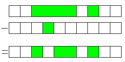

# data_region.h

data_region.h contains a DataRegion and DataRegionSet structure and various
basic set-theory functions. These may be useful for applications that need
to keep track of data access or reception. For example, if you have a certain
'streaming' IO (that can read/write arbitrary sections of data) that you want
to cache, this API can track which portions of the data have been read/written.

# License
This API is licensed under the terms of the MIT license, which is detailed 
in [LICENSE.txt](LICENSE.txt).

# Documentation
This readme file provides an overview of the API. Refer to the in-code
documentation inside of the code for specific details on each
function/structure/field.

# DataRegionSet structure
The `DataRegionSet` structure contains a set of `DataRegions` in ascending
order, with no intersecting or adjacent `DataRegions`.

# DataRegion Structure
The `DataRegion` structure is the main atomic structure of this API. It
stores the first and last index of a range. The `first index` must be less
than or equal to the `last index`, otherwise the DataRegion must be considered
invalid. In this document, a DataStructure value will be written as an ordered
pair with parentheses: (`first index`, `last index`).

### Adjacent DataRegions
Two DataRegions are considered adjacent if there is no gap between them.
Specifically, if one DataRegion's `last index` is exactly one less than the
other's `first index`, then the two are considered adjacent.
The `data_region_are_adjacent` function can be used to determine whether two
DataRegions are adjacent.

#### Examples of adjacent DataRegions

{ (1,1), (2,300) }\
{ (0,3), (4,5) }

### Intersecting DataRegions
Two DataRegions are considered intersecting if at least one index is shared by
both. The `data_region_intersects` function can be used to determine whether
two DataRegions intersect.

#### Examples of intersecting DataRegions
| First DataRegion | Second DataRegion | Intersection Region |
|------------------|-------------------|---------------------|
| (0,100)          | (0,0)             | (0,0)               |
| (0,100)          | (100,100)         | (100,100)           |
| (0,100)          | (25,50)           | (25,50)             |
| (50,60)          | (0,100)           | (50,60)             |
| (50,60)          | (0,50)            | (50,50)             |
| (50,60)          | (60,100)          | (60,60)             |
| (50,60)          | (0,55)            | (50,55)             |

## Combining DataRegions
When two DataRegions are `adjacent` or `intersecting`, they can (and should)
be combined into one DataRegion via the `data_region_combine` function. This
happens automatically when you use data_region_set* functions.
Note that this function requires both DataRegions to be combinable. Use the
`data_region_can_combine` function to determine whether two DataRegions can
be combined.

#### Examples of combining DataRegions
| First DataRegion | Second DataRegion | Combined Result     |
|------------------|-------------------|---------------------|
| (0,100)          | (1,1)             | (0,100)             |
| (50,100)         | (0,49)            | (0,100)             |
| (1,1)            | (2,2)             | (1,2)               |
| (0,50)           | (25,100)          | (0,100)             |

## Adding a DataRegion to a DataRegionSet
The `data_region_set_add` function will add a DataRegion to a DataRegionSet.
The input DataRegion will be inserted at the correct position (to maintain
ascending order), and any intersecting or adjacent DataRegions within the set
will be combined with it.

#### Examples
|     Input set     | Input DataRegion |   Resulting set   |        Visual        |
|-------------------|------------------|-------------------|----------------------|
| { (0,1) }         | (1,2)            | { (0,2) }         | |
| { (0,1) }         | (2,2)            | { (0,2) }         | |
| { (3,3), (5,6) }  | (2,7)            | { (2,7) }         | |
| { (3,3), (5,6) }  | (4,4)            | { (3,6) }         | |
| { (1,1), (3,3), (6,8) } | (2,2)      | { (1,3), (6,8) }  ||  

## Removing a DataRegion from a DataRegionSet
The `data_region_set_remove` function will remove a DataRegion from a
DataRegionSet. Any DataRegion within the set that intersects the argument
DataRegion will be modified such that the intersecting region is removed.
It is possible that a DataRegion within the DataRegionSet will be split into
two pieces, so the set may end up with more DataRegions than before the removal
operation was performed.

#### Examples
|     Input set     | Input DataRegion |   Resulting set   |        Visual        |
|-------------------|------------------|-------------------|----------------------|
| { (2,5), (7,7) }  | (3,3)            | { (2,2), (4,5), (7,7) }| |
| { (2,4) }         | (1,3)            | { (4,4) }         | |

## Getting cropped DataRegions within a DataRegionSet
If you need to get all DataRegions within a DataRegionSet, but limited to a 
specific boundary DataRegion, use the `data_region_set_crop` function. This
function will crop all DataRegions within the DataRegionSet to the specified
boundary DataRegion.

#### Examples

|     Input set     | Input DataRegion |   Resulting set   |        Visual        |
|-------------------|------------------|-------------------|----------------------|
| { (2,5), (7,7) }  | (3,3)            | { (3,3) }         | |
| { (2,5), (7,8) }  | (3,7)            | { (3,5), (7,7) }  | |

## Getting missing/negative-cropped DataRegions from a DataRegionSet
If you need to know which DataRegions are *missing* from a DataRegionSet,
like the negative of a cropped DataRegionSet, use the
`data_region_set_negative_crop` function. This function will obtain a
'negative' of the set, bounded by a specific DataRegion.

#### Examples

|     Input set     | Input DataRegion |   Resulting set   |        Visual        |
|-------------------|------------------|-------------------|----------------------|
| { (2,5), (7,8) }  | (0,9)            | { (0,1), (6,6), (9,9) }| |
| { (2,5), (7,8) }  | (3,7)            | { (6,6) }         | |

